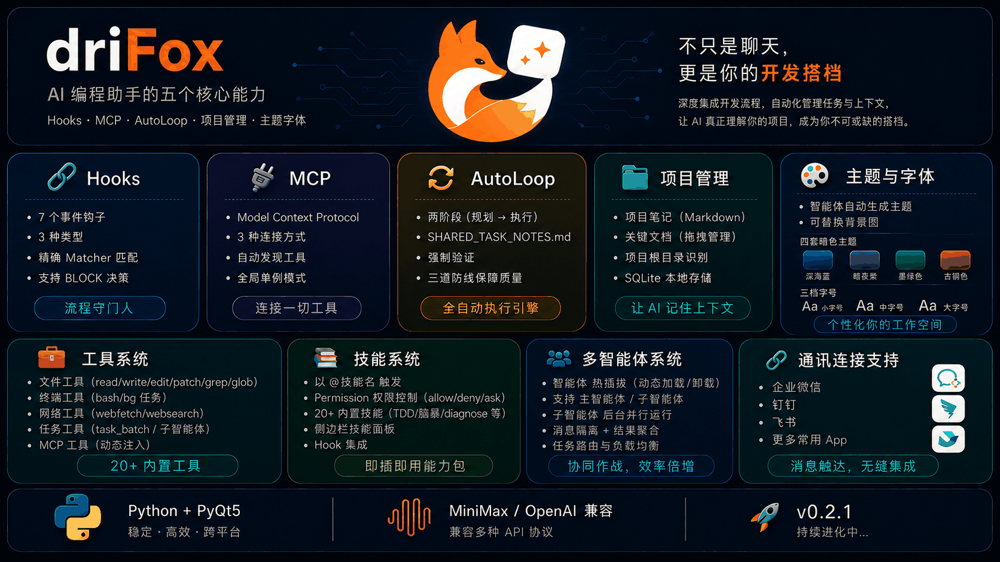
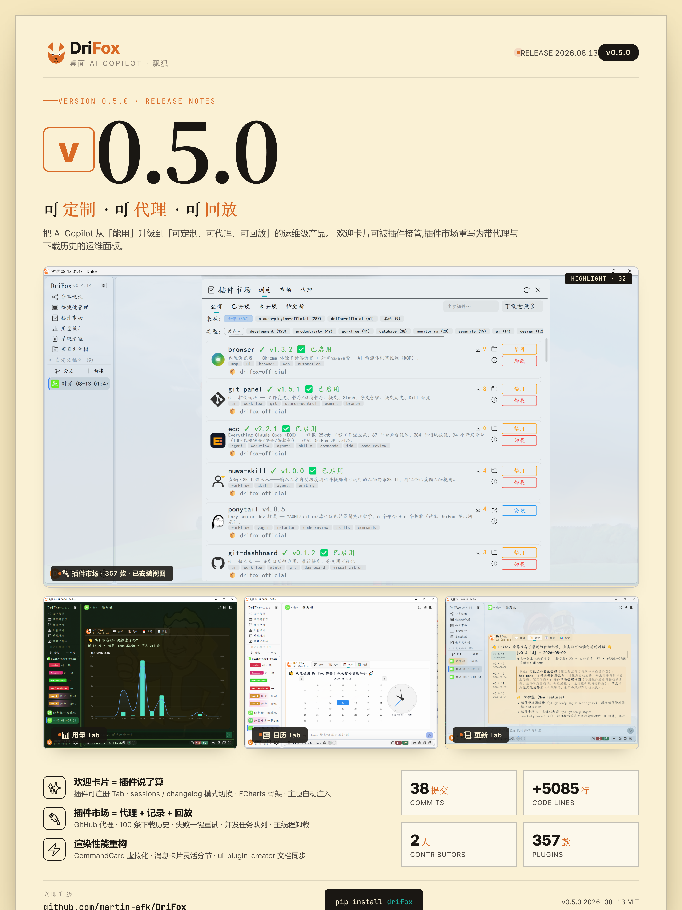
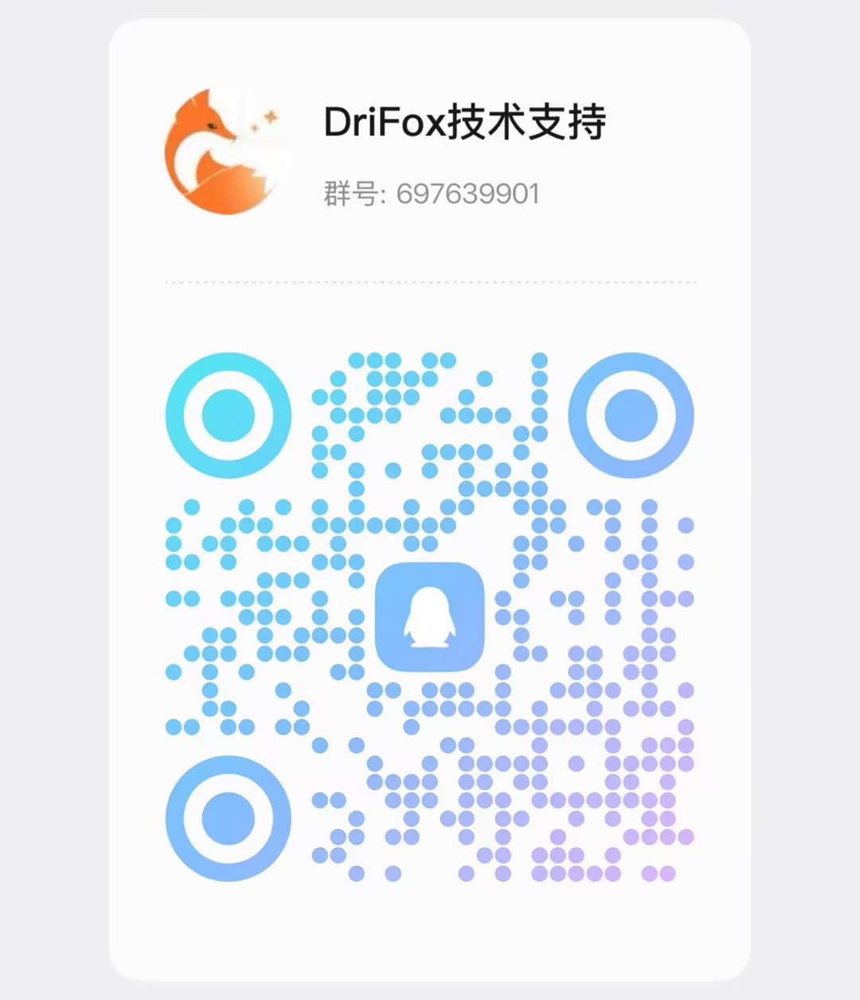

<!-- README.md -->
<p align="center">
  
</p>
<p align="center">
  
</p>

<div align="center">


</div>

<h1 align="center">DriFox 飘狐 — AI 智能体团队编排平台</h1>

<p align="center">
  <b>不是聊天框，是一间只有你一个员工的 AI 公司。</b><br>
  Leader 派单 · 多团队并存 · 跨团队协同 · 任意 OpenAI 兼容模型
</p>





---

使用中遇到问题欢迎加入技术支持群进行反馈！



---

## 什么是「一人公司」？

DriFox 把"团队"建模为**多窗口 + 文件邮箱**——把"团队协作"这套工程实践搬进 AI 智能体场景：

> 想象你是一个独立创业者，但你不是一个人——你拥有一支 AI 团队：
>
> | 角色 | 工作 |
> | --- | --- |
> | 🎯 **产品团队 Leader** | 拆需求、写 PRD、排优先级 |
> | 💻 **前端团队** × N | 组件开发、UI 调优 |
> | ⚙️ **后端团队** × N | API、数据库、性能 |
> | 🧪 **测试团队** | 自动化测试、用例覆盖 |
> | 🧭 **CEO + Coordinator**（可选） | 跨团队协调、应急仲裁 |
>
> 你只负责**定方向**。其余全部由 DriFox 的多窗口 Agent 团队协作完成。
>
> **Leader 自己**就是 DriFox 的灵魂——它按 **P0/P1/P2 三级协议**派单（紧急打断 / 任务变更 / 普通补充），能并行就并行、有人空闲就立刻填满，**绝不让任何成员"干等"**。

---

## 🧭 与 Claude Code / DeepSeek Harness 的核心差异

> **比较时点**：2026-08-17。
> Claude Code Agent Teams 仍为 **research preview / experimental**（需 `CLAUDE_CODE_EXPERIMENTAL_AGENT_TEAMS=1` 启用）。
> DeepSeek Harness 仍为 **developer preview**（2026-08-13 发布）。

| 维度 | **DriFox** | Claude Code (Agent Teams) | DeepSeek Harness (`dsh`) |
|---|---|---|---|
| **核心定位** | 多团队并存 + Leader 派单 | 单团队多 worker + 1 orchestrator | 插件编排 + 可调用 Claude Code / Codex 作 subagent |
| **多团队并存** | ✅ **run_id / team_label**（M1，同进程跑多个团队） | ❌ 单会话单团队 | ⚠️ plugin-based，无显式多团队概念 |
| **跨团队互通** | ✅ **跨团队邮件放行 + from_run_id/to_run_id 打标** | ❌ | ❌ |
| **团队模型** | 多窗口 + 文件邮箱（原子 JSON 写） | `.claude/teams/<id>/inbox/`（`<teammate-message>` 注入） | Cordis plugin + `@deepseek-ai/dsh-tool-subagent*` |
| **子智能体↔子智能体通信** | ✅ 邮件 peer-to-peer（leader 通过话术协议兜底） | ✅ sendMessage（agent↔agent 直发 + 广播） | ✅ continuable activation + `relay` form |
| **可继续子智能体** | ❌ 一次性（leader 可用 P0 中断重派） | ⚠️ cold resume 支持 partial | ✅ continuable activation（FIFO inbox + cold-resume） |
| **打断机制** | ✅ **协议层 P0/P1/P2**（写在 agent prompt 里） | ⚠️ 平台 API `interrupt_agent` | ✅ 平台 API `SubagentRuntime.interrupt` |
| **Agent Persona 隔离** | ✅ per-agent `prompt`/`description`/`color`/`temperature`/`model` | ✅ 子智能体独立 system prompt | ✅ `deployment.persona` 影子模板 |
| **工具隔离** | ✅ per-agent `tools` 白名单 + `PermissionResolver` | ✅ `allowedTools` in `.claude/agents/*.md` | ✅ `toolFilter`（`tools.restrict()`） |
| **输出结构化** | ✅ 邮件 dict 契约（`from_agent`/`to_identifier`/`status`/`result`/`run_id`） | ❌（无原生 schema） | ✅ `outputSchema` + `assertObjectJsonSchema` |
| **委派深度限制** | ❌ | ❌ | ✅ `depthLimit`（descriptor 校验） |
| **会话内容级恢复** | ✅ **一键恢复团队 + 每个成员的历史消息** | partial（session resume，不含内容恢复） | ✅ cold-resume |
| **多模型后端** | ✅ **原生 OpenAI 兼容**：OpenAI / Claude / DeepSeek / Gemini / Groq / MiniMax / 通义 / 智谱 / Ollama / 火山方舟 / 百度千帆 / SiliconFlow | ⚠️ 需 proxy（claude-code-proxy / claude-code-openai-wrapper / Bifrost gateway） | ✅ plugin-based，可接入任意 LLM 适配器 |
| **开源协议** | MIT | 闭源（商业） | MIT |
| **技术栈** | Python 3.14+ / PyQt5 | TypeScript / Node | TypeScript + Cordis 插件框架 |
| **开发成熟度** | v0.5.3（持续迭代） | 研究预览（v2.1.32+） | 开发者预览（2026-08-13） |

### DriFox 真正独有的三件事

1. **多团队并存（M1）**——同一进程跑产品 / 后端 / 前端 / 测试等多个团队，跨团队消息放行 + `from_run_id/to_run_id` 打标可追溯。Claude Code / Harness 都不支持。
2. **协议层 P0/P1/P2 打断**——通过 `plugins/system/agents/leader.md` 的话术协议实现，不需要平台 API 改造，加 P3/P4 改一行字就全员生效。Claude Code / Harness 都用平台 API（更结构化但扩展成本高）。
3. **会话内容级恢复**——`_on_team_restore_requested` 按 run_id 查 SQLite 收集成员会话，逐 agent 建窗并注入历史消息，恢复的不是空窗口而是**完整对话上下文**。

---

## 核心特性一览

| 特性 | 说明 |
|------|------|
| 🧭 **AI 智能体团队编排** | 多窗口团队、文件邮箱、Leader 派单、P0/P1/P2 三级打断协议、多团队并存（M1）、一键会话内容级恢复 |
| 🤖 **多智能体并行** | 20+ 子智能体，并行派发（`subagent_para`）+ DAG 工作流编排（`subagent_dag`，失败级联跳过）+ ECharts DAG 可视化 |
| 🎯 **极简悬浮界面** | 置顶对话框，随开随用，支持穿透/透明度/锁定 |
| 🔀 **分支会话** | 问题分叉，多窗口并行，待办追踪 |
| 🌲 **Git Worktree** | UI 直接管理 worktree，AI 感知当前分支 |
| 🧠 **长记忆系统** | SQLite 持久化，置信度评分，自动学习偏好 |
| 📊 **上下文压缩** | Token 预算控制，长对话自动摘要，环形图可视化 |
| 📈 **交互式图表** | ```echarts` 代码块渲染 ECharts 图表 |
| ☁️ **词云总结** | `/wordcloud` 一键生成 ECharts 词云 |
| 🧩 **UI 插件系统** | 浮动卡片/内容渲染器/消息工厂，热插拔 |
| 🧠 **CodeGraph 引擎** | 语义化代码探索（search/explore/callers/callees/impact）|
| 🎨 **动态主题系统** | 21 套主题，浅色/深色，组件级感知 |
| 🧩 **插件系统** | 33+ 即装即用插件，命令/Agent/Skill/主题/Hook/MCP |
| 🛠️ **40+ 内置工具** | 文件/执行/网络/代码/桌面/团队/MCP |
| 🔌 **多模型** | **原生 OpenAI 兼容**：OpenAI / Claude / DeepSeek / MiniMax / 通义 / Gemini / Groq / OpenCode Zen / OpenCode Go / SiliconFlow / Ollama / 火山方舟 / 百度千帆 / 智谱AI |
| ☁️ **Gitee 云同步** | OAuth 绑定，配置自动备份/恢复，图床上传，分享记录云端管理，Token 自动续期 |
| 🌐 **MCP 系统** | Model Context Protocol，扩展工具能力 |
| 🔌 **Hook 系统** | 6 种事件钩子，PreToolUse 可 BLOCK |
| 🧩 **Skill 系统** | 25+ 即用技能，可自行扩展 |
| 🖼️ **图片富媒体** | Markdown/HTML 图片原生渲染 |
| 🐾 **桌宠系统** | PixelPet 桌面宠物，状态动画 |
| 🚀 **自动更新** | 自动检查新版本 |
| 🌐 **models.dev 动态同步** | 启动时从 models.dev 拉取最新模型元数据，24h 缓存，增量合并 |
| 🧩 **模型参数服务商级隔离** | 同名模型在不同服务商下的参数配置互不干扰 |

---

## 快速开始

### 环境要求
- Python 3.14+
- PyQt5 >= 5.15.0

### 安装

```bash
git clone https://github.com/martin98-afk/DriFox.git
cd DriFox
pip install uv
uv sync
# 可选组件组
uv sync --group gateway     # 通讯平台（钉钉/Telegram/Discord/飞书/Slack）
uv sync --group dev         # 开发工具（pytest/ruff/mypy）
uv sync --group build       # 跨平台打包
uv sync --all-groups        # 全部安装
```

### 运行

```bash
python main.py
```

---

## 架构概要

```
┌──────────────────────────────────────────────────────────────┐
│                    DriFox v0.5.3 架构                       │
├──────────────────────────────────────────────────────────────┤
│  UI 层      悬浮窗口 / 消息卡片 / 差异视图 / 输入区         │
│             浮动卡片 / 桌宠 / 系统托盘 / 设置面板            │
│  渲染层     Markdown→HTML / ECharts / 图片 / 代码高亮       │
│  引擎层     对话引擎 / 工具执行 / 插件管理 / DAG 编排        │
│             Agent管理 / Hook管理 / 上下文压缩 / Gateway      │
│             UI引擎 / 团队系统 / CodeGraph / Cron定时任务     │
│  存储层     会话管理 / 记忆系统 / 日志持久化 / SQLite        │
└──────────────────────────────────────────────────────────────┘
```

---

## 🧭 团队编排深度说明

### 团队 = 多窗口 + 文件邮箱

```
~/.drifox/teams/
├── default/                     ← 团队目录（每个团队一个目录）
│   ├── team.json                ← 团队元信息 + 成员列表
│   └── mailboxes/{window_id}/   ← 每个成员的消息邮箱（JSON 文件）
│       ├── {mail_id}.json
│       └── ...
├── team_product/                ← 另一团队（M1 多团队并存）
└── ...
```

- **每个聊天窗口 = 1 个团队成员**（一个角色、一个 `window_id`）
- **每个成员 = 1 个独立 Agent 身份**（per-agent 工具白名单 / 提示词 / 模型）
- **邮件** = 团队目录下的 JSON 文件（原子写：tmp + `os.replace`）
- **Leader** 通过 `team_send_message(to_agent, message)` 派单，成员处理完自动通过 Stop hook 回复结果

### Leader 的三级打断协议（`plugins/system/agents/leader.md`）

| 标记头 | 级别 | 适用场景 | 成员预期行为 |
|---|---|---|---|
| `【⚠️ 紧急打断 P0】` | 最高 | 用户指令变更、安全/数据风险、全局阻塞依赖 | 立即暂停当前子任务 → 优先处理 → 秒回确认 |
| `【🔁 任务变更 P1】` | 高 | 依赖变化、需求调整、上游成果修正 | 完成当前原子步骤后优先处理（不中断中途工具循环） |
| `【📝 补充 P2】` | 普通 | 进度询问、接口约定同步、非紧急澄清 | 不打断；在自然暂停点（子任务完成/回合间隙）回复 |

每条打断消息必须含六要素：**标记头 / 来源原因 / 受影响任务编号 / 具体指令 / 预期响应 / 恢复计划**。
防滥用规则：**P0 仅限三类**（用户指令变更 / 安全数据风险 / 全局阻塞依赖）；**每任务 P0 ≤1 次**；**能重派不打断**。

### 多团队并存（M1，commit `12408ee2`）

- **run_id** 标识一次团队运行；**team_label** 标识团队对外名
- `TeamManager.get_member_run_id(window_id)` 反查成员所属团队
- **跨团队邮件放行 + 打标**：`mail dict` 写入 `from_run_id` / `to_run_id`，历史面板可追溯
- 顶层 `team_members` 快照与 `members` 双写，恢复时优先快照

### 一键恢复团队 + 历史会话

`main_widget._on_team_restore_requested(run_id)`：

1. 查 SQLite 收集该 run_id 全部成员会话（绕开 `_history_limit=500` 截断）
2. 解散当前团队、关闭团队窗口
3. 按 `agent_name` 去重（同角色多窗口各保留一条）
4. **逐 agent 新建窗口 + 注入历史消息**（`history_manager.get_session_messages(session_id)`）
5. 复用当前 `run_id`（用户期望恢复后归属原团队会话）
6. Tab 分组按 run_id 同组

恢复语义：内容恢复 + 新 `session_id`（不覆盖原历史记录）。

### 派单最佳实践（来自 leader.md）

- **并行优先、流水线作业、最小化总完成时间**
- 首波无依赖任务一次性同时派出（不要分开发）
- 收到汇报即派下一波（不要"先验收再派发"两步串行）
- 探索类子任务与修改类子任务并行（若有 explore 角色）
- 失败不卡死：派给备用成员或拆分后重派

---

## 功能速览

### 核心交互
- **会话并行** — 多窗口并行，分支会话独立探索，内置待办追踪
- **Git Worktree** — 树状展示所有 worktree，一键切换/新建/删除
- **代码差异对比** — 单栏/双栏视图，语法高亮，单词级高亮，统计摘要
- **上下文压缩** — Token 预算环形图，LLM 摘要，`/compact` 命令
- **穿透模式** — 悬浮窗口可穿透点击，透明度 0-100% 可调
- **托盘管理** — 系统托盘常驻，窗口循环排列模式

### 图表与可视化
- **ECharts 图表** — 折线/柱状/饼图/散点/关系图/雷达图/词云，暗色/浅色主题
- **DAG 工作流图** — 子智能体执行时自动生成力导向节点图，状态颜色编码
- **词云总结** — `/wordcloud [焦点]` 一键提取 15-30 个关键术语
- **上下文用量环形图** — 实时显示 Token 占用比例，堆叠柱状图详情

### UI 插件系统 (v0.3.0+)
插件可渲染三种 UI 组件：**浮动卡片**（独立面板，自动注册 `/命令`）、**内容渲染器**（自定义消息块）、**消息工厂**（自定义 Widget）。支持热插拔、多窗口隔离、上下文注入。内置 4 个 UI 插件：上下文用量统计、项目文件树、Git 仪表盘、_vendor/ 依赖演示。

### CodeGraph 代码智能引擎 (v0.3.4+)
语义化代码探索工具，5 种模式：`search`（搜索符号）、`explore`（综合探索+调用上下文）、`callers`（谁调用了）、`callees`（调用了谁）、`impact`（变更影响分析）。工作目录变更时自动重初始化。

### 动态主题系统 (v0.3.1/0.3.7+)
21 套主题（含浅色系列：daylight, cloud, pearl 等），组件级主题感知，Pyhments 语法高亮多主题适配，实时切换无需重启。

---

## 智能体系统

三层设计：**Primary / Subagent / Hidden**，Markdown+YAML frontmatter 定义。

| 类型 | 典型 Agent |
|------|-----------|
| **Primary** | plan（规划）、build（编码）、code-reviewer（审查）|
| **Subagent** | explore、leader（团队领导，P0/P1/P2 三级打断）、architecture-critic、security-auditor、test-engineer、legacy-analyst、code-simplifier、deep-research、diagnose、perf-analyzer、business-rules-extractor 等 15+ |
| **Hidden** | summary、compaction、title、auto_loop（autoloop 插件） |

支持 DAG 工作流编排、并行分发（subagent_para）、级联执行（subagent_dag）。

**per-agent 工具隔离**：YAML 中声明 `tools: { read: true, write: true, bash: false }`，`PermissionResolver` 按 agent 身份校验。
**per-agent Persona**：`prompt` / `description` / `color` / `temperature` / `model` 均为 agent 身份独立配置。

---

## 🗺️ 路线图

| 阶段 | 状态 | 关键能力 |
|---|---|---|
| **v0.3.x** | ✅ 已发 | 团队协作、Leader、CodeGraph、21 主题 |
| **v0.4.x** | ✅ 已发 | Gitee 云同步、性能优化、桌宠 |
| **v0.5.x** | ✅ 已发 | 多团队并存（M1）、跨团队邮件放行、P0/P1/P2 协议、会话内容级恢复 |
| **v0.6** | 🔜 计划 | meta-leader 模板（产品/前端/后端/测试 + CEO）、可继续子智能体、全局 `list_agents`、跨团队状态合并面板 |
| **v0.7** | 📋 规划 | 委派深度限制（`max_depth`）、协作 interrupt（按 P0 协议优雅退出）、append-only SessionEvent 可重放 timeline |

---

## 插件系统

```
plugins/system/          # 系统内置插件（打包在 exe 中）
.drifox/plugins/         # 用户安装的第三方插件
```

**插件组件类型**：commands/（命令）、agents/（智能体）、skills/（技能）、themes/（主题）、hooks/（Hook）、.mcp.json（MCP 配置）、ui/（UI 组件）

**21 主题**：amber, azure, bordeaux, cloud, crema, daylight, fallout, forest, graphite, jade, laven, lumia, meadow, midnight, minta, obsidian, ocean, pearl, rosee, sakura, slate

**Skills (25+)**：brainstorming, tdd, diagnose, caveman, ui-plugin-creator, agent-canvas-designer, github-ops, session-summary, subagent-driven-development, grill-me, writing-plans, git-commit, find-skills, triage, zoom-out 等

**新命令 (since v0.2.6)**：`/team`、`/theme`、`/title-gen`、`/toggle-window`、`/clear`、`/subagents`、`/webresearch`、`/remember`、`/todos`、`/lsp-install`、`/verify`、`/release`、`/receive-review`、`/worktree`

---

## 工具系统（40+）

| 类别 | 工具 |
|------|------|
| **文件** | read, write, edit, multi_edit, grep, glob, list, upload_file |
| **执行** | bash, bg_start/stop/logs/list |
| **网络** | webfetch, websearch |
| **代码** | get_diagnostics, lsp, codegraph_explore |
| **桌面** | screenshot, mouse, keyboard |
| **子智能体** | subagent_para, subagent_dag, subagent_status |
| **团队** | team_list_members, team_send_message |
| **MCP** | `mcp__server__tool`（连接 MCP Server 后自动出现）|
| **记忆** | memory_save/search/list |
| **其他** | scan_repo, stage_files, question, todowrite/read |

> **websearch API key 配置**：`websearch` 工具通过环境变量读取搜索服务 API key——
> `TAVILY_API_KEY`（Tavily 搜索）、`TINYFISH_API_KEY`（TinyFish 搜索，Tavily 不可用/未配置时回退）。
> 不再从应用配置读取，请在启动环境（系统环境变量或启动脚本）中设置；两者均未设置时，
> `websearch` 返回「搜索失败：无可用搜索引擎」。

---

## Hotkeys & Commands

| 快捷键 | 功能 |
|--------|------|
| `ALT+Z` | 全局热键唤起/隐藏主窗口 |
| 命令 `/command` | 所有系统/插件命令统一通过 `/` 触发 |

---

## 更新日志 (v0.3.x 亮点)

| 版本 | 亮点 |
|------|------|
| **v0.5.2** | **多团队并存 TeamManager** (M1，commit `12408ee2`)、跨团队邮件放行+`from_run_id/to_run_id` 打标、会话内容级恢复、Leader P0/P1/P2 三级打断协议 |
| **v0.4.7** | **Gitee OAuth Token 自动刷新** — refresh_token 滚动续期，ConfigSync 全链路同步，401 自动重试，不再因 token 过期而中断服务 |
| **v0.4.6** | Gitee 配置云同步增强（user-custom 插件备份/恢复、分享记录管理），工具权限自动同步，Token 过期防护 |
| **v0.4.5** | 子智能体紧凑卡片高度修复，Windows 暗色模式 Tooltip 修复 |
| **v0.4.4** | 性能优化：差分渲染、增量内存保存、MCP 超时优化、死代码清理 |
| **v0.4.3** | 统一发送/停止按钮，暗色/浅色主题适配，状态动画优化 |
| **v0.4.2** | 浅色主题全面升级，21 套主题组件级感知，禁用状态视觉优化 |
| **v0.4.1** | 配置云同步，user-custom 插件云端备份/恢复，项目导出异步化，分享记录管理 |
| **v0.4.0** | **🎉 Gitee 云端集成** — OAuth 账号绑定，图床上传，配置云备份，快捷键冲突检测，子智能体工具结果增强展示 |
| **v0.3.11** | models.dev 动态模型同步, OpenCode Go 独立服务商, 模型参数服务商级隔离 |
| **v0.3.10** | 搜索引引擎修复 (Tavily+TinyFish), toggle-window 修复 |
| **v0.3.9** | 消息指纹, toggle-window/clear 命令, 浮动tooltip独立窗口, 平滑动画 |
| **v0.3.8** | 性能优化, 灾难性回溯修复, JSON 序列化兼容性 |
| **v0.3.7** | 浅色主题, 21套主题全面升级, 组件级主题感知 |
| **v0.3.6** | 上下文用量统计增强, Hook Token追踪, 跨组件Token同步 |
| **v0.3.5** | 大量bug修复, 流式预览增强, CodeGraph同步优化 |
| **v0.3.4** | **CodeGraph 代码智能引擎**, Diff双栏视图, 团队窗口管理 |
| **v0.3.3** | **团队协作系统**, Leader智能体, 任务邮件, `/team` 模板管理 |
| **v0.3.2** | 共享线程池, 子智能体会话对话框, Hook持久化覆盖, 来源项目追踪 |
| **v0.3.1** | 动态主题系统, `/title-gen` 命令, file-tree拖拽移动 |
| **v0.3.0** | **🎉 UI 插件系统** — 浮动卡片/内容渲染器/消息工厂, 4个内置UI插件 |

---

## 技术栈

| 技术 | 用途 |
|------|------|
| PyQt5 + PyQt-Fluent-Widgets | GUI 框架 |
| PyQtWebEngine | HTML/Markdown/ECharts/图片渲染 |
| ECharts 5 | 交互式图表 |
| SQLite | 持久化存储 |
| OpenAI Python Client | LLM API 调用 |
| loguru | 日志 |
| mcp | Model Context Protocol |
| uv | 包管理/构建 |
| codegraph-py | 代码智能引擎 |
| fastapi + uvicorn | 本地 HTTP 服务 |

---

## 许可证

MIT License © 2025~2026 Martin98-afk

---

## Star History

<a href="https://www.star-history.com/?repos=martin98-afk%2FDriFox&type=date&legend=top-left">
 <picture>
   <source media="(prefers-color-scheme: dark)" srcset="https://api.star-history.com/chart?repos=martin98-afk/DriFox&type=date&theme=dark&legend=top-left&sealed_token=Mj0svdTPVm6s6qDntASYYQqJLSX5AfawcRyiwnc0DgeiouRtmfVM0ntXBFKOoHCj87QFuUZ68P5R5PsiJysn6K3lQpuStvpIkT09ogKvzsC_7mwNN06FPMDvipYnQ0nJQzYPh6rnlzhnDrhPVuPritcgSRsTZpfbERXnVQorhFjVfy-PUKfSwLGLaOTF" />
   <source media="(prefers-color-scheme: light)" srcset="https://api.star-history.com/chart?repos=martin98-afk/DriFox&type=date&legend=top-left&sealed_token=Mj0svdTPVm6s6qDntASYYQqJLSX5AfawcRyiwnc0DgeiouRtmfVM0ntXBFKOoHCj87QFuUZ68P5R5PsiJysn6K3lQpuStvpIkT09ogKvzsC_7mwNN06FPMDvipYnQ0nJQzYPh6rnlzhnDrhPVuPritcgSRsTZpfbERXnVQorhFjVfy-PUKfSwLGLaOTF" />
   
 </picture>
</a>